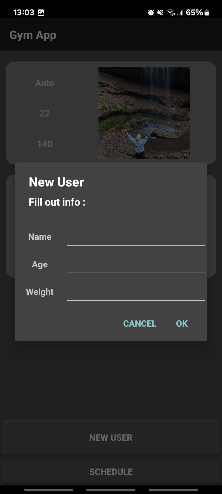
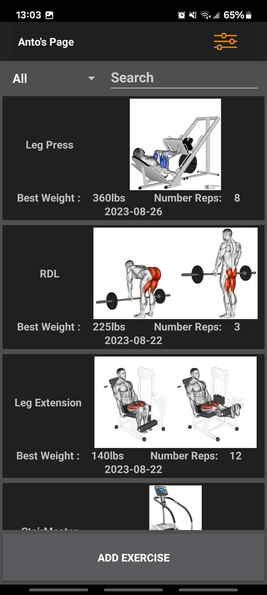
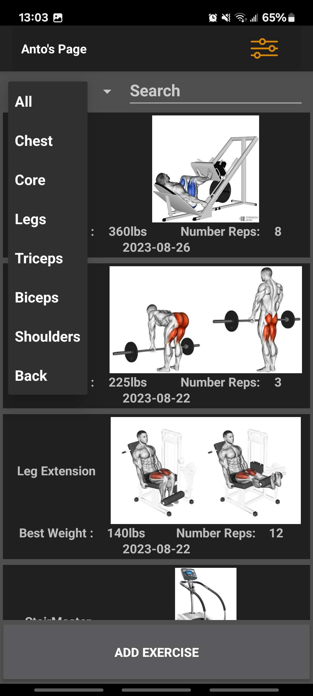
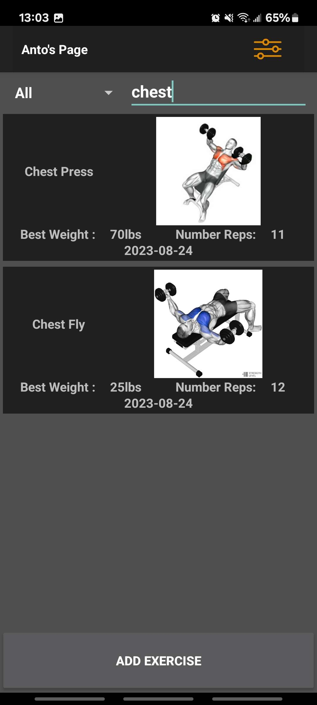
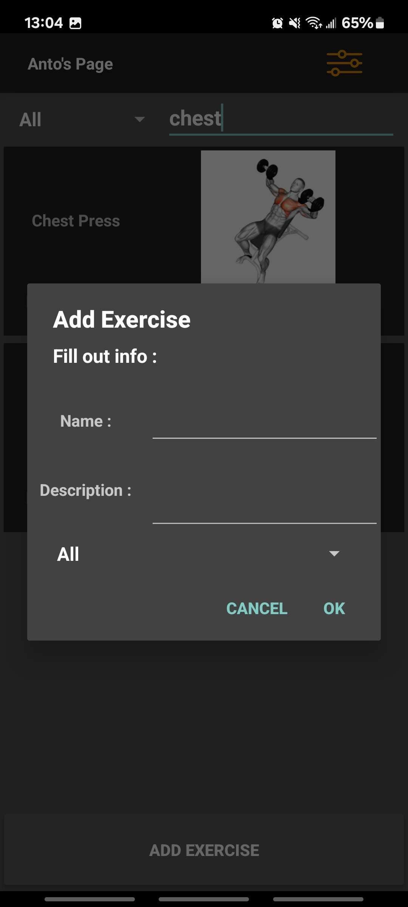
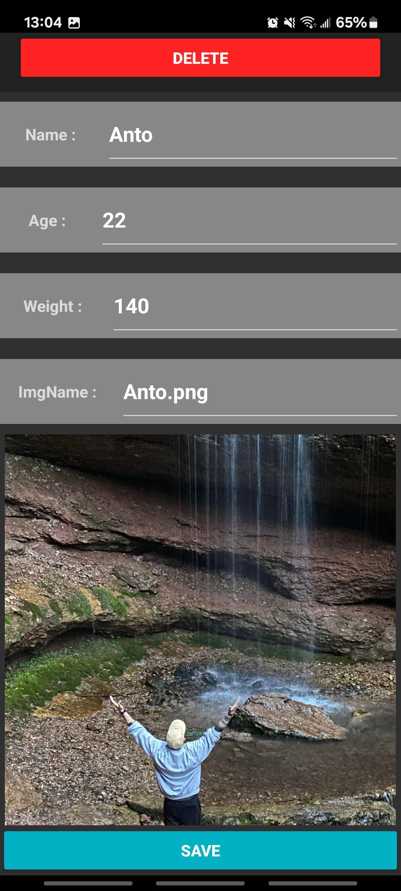
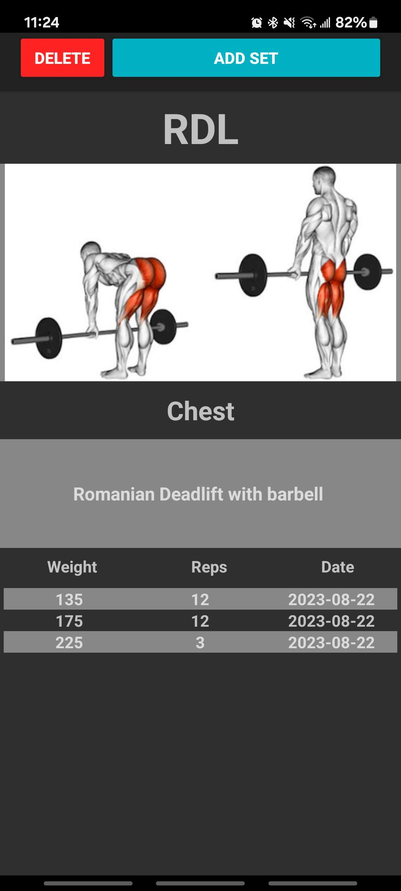
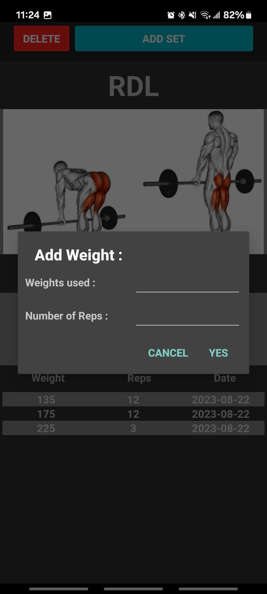

<h1> Gym App </h1>  

    This gym application is an upgraded version of my previous gym application, which was
    developed in class. Its purpose is to display a list of exercises from a database and retain records of previous
    weights used while behing able to to have multiple differnet users.

 

<h2> <a href="https://www.youtube.com/watch?v=mzluNtjtzCs">
        Project Video in French</a> </h2>

<h2> Project Gallery </h2>

     
    
    
    
    
    
    
    
    

